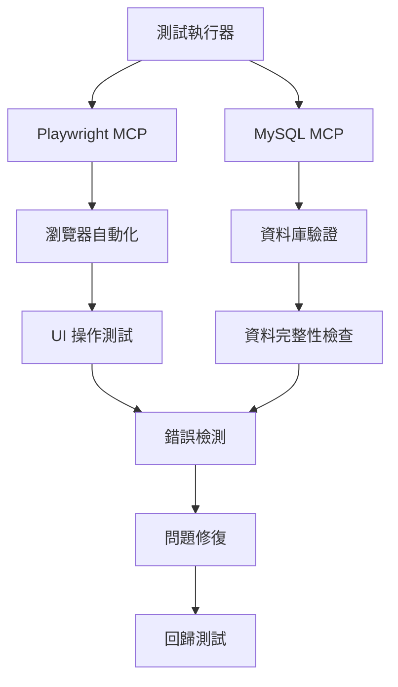

# 系統全面功能測試設計文件

## 概述

本設計文件定義了如何使用 Playwright MCP 和 MySQL MCP 工具來執行全面的系統功能測試，從登入頁開始依序測試每個功能，並在發現問題時進行修復。

## 架構

### 測試架構設計



### 測試流程設計

1. **環境準備階段**
   - 檢查 Docker 容器狀態
   - 驗證測試資料存在
   - 啟動瀏覽器實例

2. **功能測試階段**
   - 按照選單順序依序測試
   - 每個功能執行完整的 CRUD 操作
   - 記錄測試結果和截圖

3. **問題修復階段**
   - 分析發現的問題
   - 實施修復方案
   - 執行回歸測試

4. **報告生成階段**
   - 彙整測試結果
   - 生成問題報告
   - 提供修復建議

## 元件和介面

### 測試執行元件

#### 1. 環境檢查器 (EnvironmentChecker)
- **職責**: 檢查測試環境是否就緒
- **介面**: 
  - `checkDockerStatus()`: 檢查 Docker 容器狀態
  - `verifyTestData()`: 驗證測試資料存在
  - `initializeBrowser()`: 初始化瀏覽器

#### 2. 功能測試器 (FunctionTester)
- **職責**: 執行各功能模組的測試
- **介面**:
  - `testLogin()`: 測試登入功能
  - `testDashboard()`: 測試儀表板功能
  - `testUserManagement()`: 測試使用者管理
  - `testRoleManagement()`: 測試角色管理
  - `testPermissionManagement()`: 測試權限管理
  - `testActivityLogs()`: 測試活動記錄
  - `testNotifications()`: 測試通知管理
  - `testSystemSettings()`: 測試系統設定
  - `testProfile()`: 測試個人資料
  - `testNavigation()`: 測試導航功能

#### 3. 問題檢測器 (IssueDetector)
- **職責**: 檢測和分類問題
- **介面**:
  - `detectUIIssues()`: 檢測 UI 問題
  - `detectFunctionalIssues()`: 檢測功能問題
  - `detectPerformanceIssues()`: 檢測效能問題
  - `detectSecurityIssues()`: 檢測安全問題

#### 4. 修復執行器 (FixExecutor)
- **職責**: 執行問題修復
- **介面**:
  - `fixLivewireIssues()`: 修復 Livewire 相關問題
  - `fixUIIssues()`: 修復 UI 問題
  - `fixValidationIssues()`: 修復驗證問題
  - `fixPermissionIssues()`: 修復權限問題

### 資料模型

#### 測試結果模型
```typescript
interface TestResult {
  testName: string;
  status: 'pass' | 'fail' | 'skip';
  duration: number;
  screenshot?: string;
  errorMessage?: string;
  dataValidation?: DatabaseValidation;
}

interface DatabaseValidation {
  query: string;
  expectedResult: any;
  actualResult: any;
  isValid: boolean;
}

interface Issue {
  id: string;
  type: 'ui' | 'functional' | 'performance' | 'security';
  severity: 'low' | 'medium' | 'high' | 'critical';
  description: string;
  location: string;
  screenshot?: string;
  suggestedFix?: string;
}
```

## 測試策略

### 1. 登入功能測試策略

#### 測試場景
- 正常登入流程
- 錯誤憑證處理
- 記住我功能
- 會話管理
- 重定向邏輯

#### 實施方法
```javascript
async function testLogin() {
  // 1. 導航到登入頁面
  await playwright.navigate('http://localhost/admin/login');
  
  // 2. 檢查頁面元素
  const pageContent = await playwright.getVisibleHtml();
  
  // 3. 測試正常登入
  await livewireLogin('admin', 'admin123');
  
  // 4. 驗證登入成功
  const currentUrl = await playwright.evaluate('window.location.href');
  
  // 5. 資料庫驗證
  const loginRecord = await mysql.executeQuery({
    query: "SELECT last_login_at FROM users WHERE username = 'admin'",
    database: "laravel_admin"
  });
}
```

### 2. CRUD 操作測試策略

#### 標準 CRUD 測試流程
1. **Create (建立)**
   - 導航到建立頁面
   - 填寫表單資料
   - 提交表單
   - 驗證成功訊息
   - 資料庫驗證

2. **Read (讀取)**
   - 檢查列表頁面
   - 驗證資料顯示
   - 測試搜尋功能
   - 測試篩選功能
   - 測試分頁功能

3. **Update (更新)**
   - 導航到編輯頁面
   - 修改表單資料
   - 提交更新
   - 驗證更新成功
   - 資料庫驗證

4. **Delete (刪除)**
   - 執行刪除操作
   - 確認刪除對話框
   - 驗證刪除成功
   - 檢查軟刪除狀態

### 3. Livewire 元件測試策略

#### 特殊處理
- 使用完整的事件觸發流程
- 等待 Livewire 同步時間 (800ms)
- 驗證表單狀態同步
- 監控 AJAX 請求完成

#### 實施範例
```javascript
async function testLivewireForm(formData) {
  // 等待 Livewire 載入
  await playwright.evaluate(`
    new Promise((resolve) => {
      const checkLivewire = () => {
        if (window.Livewire) {
          resolve('ready');
        } else {
          setTimeout(checkLivewire, 100);
        }
      };
      checkLivewire();
    })
  `);
  
  // 填寫表單並觸發事件
  await playwright.evaluate(`
    Object.entries(${JSON.stringify(formData)}).forEach(([field, value]) => {
      const element = document.getElementById(field);
      if (element) {
        element.value = value;
        element.dispatchEvent(new Event('input', { bubbles: true }));
        element.blur();
      }
    });
  `);
  
  // 等待同步
  await playwright.evaluate('new Promise(resolve => setTimeout(resolve, 800))');
}
```

## 錯誤處理

### 錯誤分類和處理策略

#### 1. UI 錯誤
- **症狀**: 元素找不到、佈局錯誤、樣式問題
- **檢測**: 元素選擇器失敗、截圖比對
- **修復**: 更新選擇器、修正 CSS、調整 HTML 結構

#### 2. 功能錯誤
- **症狀**: 表單提交失敗、重定向錯誤、資料不同步
- **檢測**: 操作失敗、資料庫驗證失敗
- **修復**: 修正 Livewire 邏輯、更新路由、修復驗證規則

#### 3. 效能錯誤
- **症狀**: 頁面載入緩慢、操作回應延遲
- **檢測**: 超時錯誤、回應時間測量
- **修復**: 優化查詢、加入快取、減少 DOM 操作

#### 4. 權限錯誤
- **症狀**: 無權限存取、功能按鈕不顯示
- **檢測**: 403 錯誤、元素不存在
- **修復**: 更新權限設定、修正權限檢查邏輯

### 自動修復機制

#### 常見問題的自動修復
1. **Livewire 重置篩選問題**
   - 檢測: 重置按鈕點擊後篩選條件未清除
   - 修復: 套用標準重置篩選解決方案

2. **分頁功能問題**
   - 檢測: 分頁按鈕點擊無效
   - 修復: 套用 Livewire 分頁修復方案

3. **表單驗證問題**
   - 檢測: 驗證錯誤不顯示或顯示錯誤
   - 修復: 更新驗證規則和錯誤訊息

## 測試策略

### 測試執行順序

1. **環境準備** (5 分鐘)
   - Docker 容器檢查
   - 測試資料驗證
   - 瀏覽器初始化

2. **核心功能測試** (30 分鐘)
   - 登入功能 (5 分鐘)
   - 儀表板功能 (5 分鐘)
   - 使用者管理 (10 分鐘)
   - 角色管理 (10 分鐘)

3. **進階功能測試** (25 分鐘)
   - 權限管理 (5 分鐘)
   - 活動記錄 (5 分鐘)
   - 通知管理 (5 分鐘)
   - 系統設定 (5 分鐘)
   - 個人資料 (5 分鐘)

4. **系統測試** (15 分鐘)
   - 導航測試 (5 分鐘)
   - 響應式測試 (5 分鐘)
   - 效能測試 (5 分鐘)

5. **問題修復** (依問題數量而定)
   - 問題分析
   - 修復實施
   - 回歸測試

### 成功標準

#### 功能完整性
- 所有選單項目可正常存取
- 所有 CRUD 操作正常運作
- 所有表單驗證正確執行
- 所有權限檢查正常運作

#### 使用者體驗
- 頁面載入時間 < 3 秒
- 操作回應時間 < 1 秒
- 錯誤訊息清晰友善
- 導航直觀一致

#### 資料完整性
- 所有資料操作正確反映在資料庫
- 軟刪除功能正常運作
- 關聯資料保持一致
- 權限控制有效執行

#### 技術品質
- 無 JavaScript 錯誤
- 無 PHP 錯誤或警告
- 響應式設計正常運作
- 無障礙功能可用

這個設計確保了全面、系統性的測試方法，能夠有效發現問題並提供修復方案。