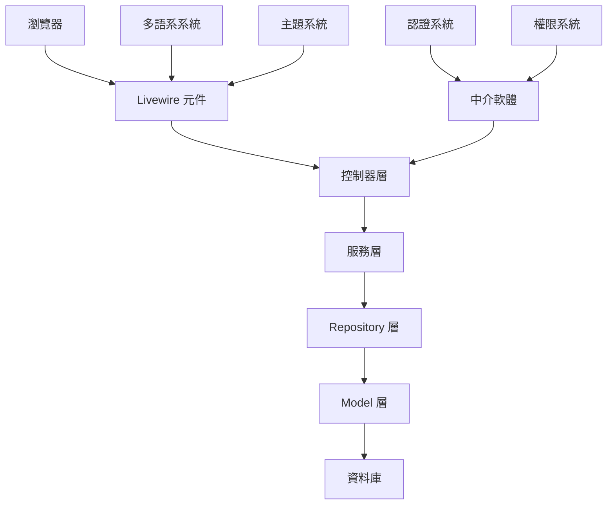
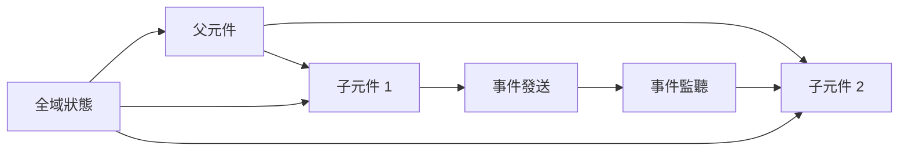
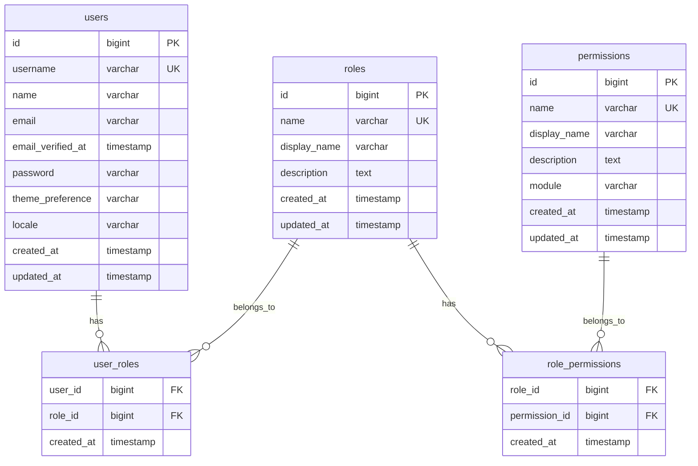
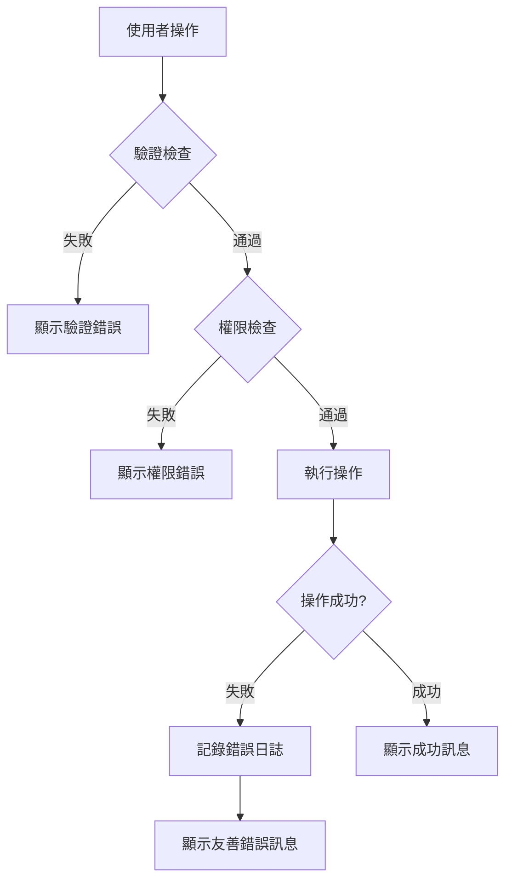
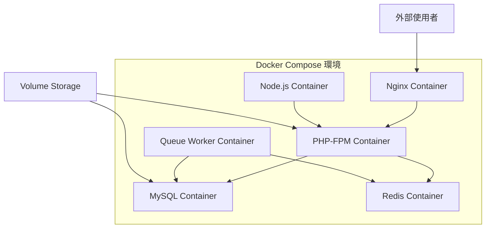

# 設計文件

## 概覽

本系統採用 Laravel 10.x 作為後端框架，結合 Livewire 3.x 提供動態前端互動體驗。系統架構遵循 MVC 模式，並採用 Repository Pattern 和 Service Layer 來確保程式碼的可維護性和可測試性。

### 技術堆疊
- **後端框架**: Laravel 10.x
- **前端互動**: Livewire 3.x
- **CSS 框架**: Tailwind CSS 3.x
- **圖示庫**: Heroicons
- **資料庫**: MySQL 8.0+
- **認證**: Laravel Sanctum
- **多語系**: Laravel 內建 i18n
- **快取**: Redis (可選)

## 架構

### 整體架構圖



### 目錄結構

```
app/
├── Http/
│   ├── Controllers/
│   │   └── Admin/
│   ├── Middleware/
│   │   ├── CheckAdminPermission.php
│   │   └── SetLocale.php
│   └── Livewire/
│       └── Admin/
│           ├── Auth/
│           ├── Dashboard/
│           ├── Users/
│           └── Roles/
├── Models/
│   ├── User.php
│   ├── Role.php
│   └── Permission.php
├── Services/
│   ├── UserService.php
│   ├── RoleService.php
│   └── PermissionService.php
├── Repositories/
│   ├── UserRepository.php
│   ├── RoleRepository.php
│   └── PermissionRepository.php
└── Traits/
    └── HasPermissions.php

resources/
├── views/
│   ├── layouts/
│   │   └── admin.blade.php
│   ├── livewire/
│   │   └── admin/
│   └── components/
│       └── admin/
├── lang/
│   ├── zh_TW/
│   └── en/
└── css/
    └── admin.css
```

## 元件和介面

### 核心 Livewire 元件

#### 1. 認證元件
- `LoginForm`: 處理使用者登入
- `LogoutButton`: 處理使用者登出

#### 2. 使用者管理元件
- `UserList`: 顯示使用者列表，支援搜尋和篩選
- `UserForm`: 建立和編輯使用者
- `UserDelete`: 處理使用者刪除確認

#### 3. 角色權限管理元件
- `RoleList`: 顯示角色列表
- `RoleForm`: 建立和編輯角色
- `PermissionMatrix`: 權限矩陣管理介面

#### 4. 儀表板元件
- `DashboardStats`: 顯示系統統計資訊
- `RecentActivity`: 顯示最近活動
- `QuickActions`: 快速操作連結

#### 5. 佈局元件
- `AdminLayout`: 主要佈局元件
- `Sidebar`: 側邊導航選單
- `TopBar`: 頂部導航列
- `ThemeToggle`: 主題切換器
- `LanguageSelector`: 語言選擇器

### 元件通訊模式



## 資料模型

### 資料庫 ERD



### Model 關聯

#### User Model
```php
class User extends Authenticatable
{
    // 使用者擁有多個角色
    public function roles(): BelongsToMany
    
    // 檢查使用者是否有特定權限
    public function hasPermission(string $permission): bool
    
    // 檢查使用者是否有特定角色
    public function hasRole(string $role): bool
}
```

#### Role Model
```php
class Role extends Model
{
    // 角色屬於多個使用者
    public function users(): BelongsToMany
    
    // 角色擁有多個權限
    public function permissions(): BelongsToMany
}
```

#### Permission Model
```php
class Permission extends Model
{
    // 權限屬於多個角色
    public function roles(): BelongsToMany
}
```

## 錯誤處理

### 錯誤處理策略

1. **驗證錯誤**: 使用 Laravel 的表單請求驗證，在 Livewire 元件中顯示即時驗證錯誤
2. **權限錯誤**: 透過中介軟體攔截，顯示 403 錯誤頁面或重新導向
3. **系統錯誤**: 記錄到日誌檔案，向使用者顯示友善的錯誤訊息
4. **網路錯誤**: Livewire 自動處理，提供重試機制

### 錯誤處理流程



### 多語系錯誤訊息

所有錯誤訊息都將支援多語系，錯誤訊息檔案結構：

```
resources/lang/
├── zh_TW/
│   ├── auth.php
│   ├── validation.php
│   └── messages.php
└── en/
    ├── auth.php
    ├── validation.php
    └── messages.php
```

### 使用者認證調整

系統使用 `username` 作為主要登入識別欄位，而非傳統的 email：

1. **登入驗證**: 使用者需要輸入 username 和密碼進行登入
2. **使用者名稱唯一性**: username 必須在系統中保持唯一
3. **Email 可選**: email 欄位為可選填，主要用於通知和密碼重設功能
4. **驗證規則**: username 需符合特定格式要求（如：3-20字元，僅允許字母、數字和底線）

## 測試策略

### 測試層級

1. **單元測試**
   - Model 方法測試
   - Service 類別測試
   - Repository 類別測試

2. **功能測試**
   - HTTP 路由測試
   - 中介軟體測試
   - 認證流程測試

3. **Livewire 元件測試**
   - 元件渲染測試
   - 使用者互動測試
   - 事件處理測試

4. **瀏覽器測試**
   - 端到端使用者流程測試
   - 響應式設計測試
   - 跨瀏覽器相容性測試

### 測試工具

- **PHPUnit**: 單元測試和功能測試
- **Livewire Testing**: Livewire 元件專用測試
- **Laravel Dusk**: 瀏覽器自動化測試
- **Pest**: 現代化的 PHP 測試框架（可選）

### 測試覆蓋率目標

- 整體程式碼覆蓋率: 85%+
- 核心業務邏輯覆蓋率: 95%+
- Livewire 元件覆蓋率: 90%+

## 效能考量

### 前端效能優化

1. **Livewire 優化**
   - 使用 `wire:key` 避免不必要的重新渲染
   - 實作 `lazy` 載入減少初始載入時間
   - 使用 `defer` 延遲非關鍵更新

2. **CSS/JS 優化**
   - 使用 Vite 進行資源打包和最小化
   - 實作 CSS 和 JS 的程式碼分割
   - 使用 CDN 載入第三方資源

### 後端效能優化

1. **資料庫優化**
   - 適當的索引設計
   - 查詢優化和 N+1 問題預防
   - 資料庫連線池配置

2. **快取策略**
   - 權限檢查結果快取
   - 使用者 session 快取
   - 靜態資源快取

3. **記憶體管理**
   - 大量資料的分頁處理
   - 適當的記憶體限制設定

## 安全性設計

### 認證安全

1. **密碼安全**
   - 使用 bcrypt 雜湊演算法
   - 強制密碼複雜度要求
   - 密碼重設機制

2. **Session 安全**
   - 安全的 session 配置
   - CSRF 保護
   - Session 固定攻擊防護

### 授權安全

1. **權限檢查**
   - 多層權限驗證
   - 最小權限原則
   - 權限繼承機制

2. **資料存取控制**
   - 基於角色的資料過濾
   - 敏感資料遮罩
   - 審計日誌記錄

### 輸入驗證

1. **前端驗證**
   - Livewire 即時驗證
   - 客戶端資料清理

2. **後端驗證**
   - 嚴格的伺服器端驗證
   - SQL 注入防護
   - XSS 攻擊防護

## 部署架構

### Docker 容器化設計

系統採用 Docker 容器化部署，確保環境一致性和可移植性。

#### 容器架構圖



#### 容器服務說明

1. **Nginx Container**
   - 作為反向代理和靜態檔案伺服器
   - 處理 SSL 終止
   - 負載平衡（生產環境）

2. **PHP-FPM Container**
   - 執行 Laravel 應用程式
   - 包含所有 PHP 擴充套件
   - Livewire 和業務邏輯處理

3. **MySQL Container**
   - 主要資料庫服務
   - 資料持久化儲存
   - 自動備份機制

4. **Redis Container**
   - Session 儲存
   - 快取服務
   - 佇列驅動

5. **Node.js Container**
   - 前端資源編譯（Vite）
   - 開發環境熱重載
   - CSS/JS 最小化

6. **Queue Worker Container**
   - 背景任務處理
   - 郵件發送
   - 資料匯出等長時間任務

### 開發環境

#### Docker Compose 開發配置

```yaml
# docker-compose.dev.yml
version: '3.8'
services:
  nginx:
    image: nginx:alpine
    ports:
      - "80:80"
      - "443:443"
    volumes:
      - ./docker/nginx/dev.conf:/etc/nginx/conf.d/default.conf
      - .:/var/www/html
    depends_on:
      - app

  app:
    build:
      context: .
      dockerfile: docker/php/Dockerfile.dev
    volumes:
      - .:/var/www/html
      - ./docker/php/php.dev.ini:/usr/local/etc/php/php.ini
    environment:
      - APP_ENV=local
      - DB_HOST=mysql
      - REDIS_HOST=redis
    depends_on:
      - mysql
      - redis

  mysql:
    image: mysql:8.0
    environment:
      MYSQL_ROOT_PASSWORD: secret
      MYSQL_DATABASE: laravel_admin
      MYSQL_USER: laravel
      MYSQL_PASSWORD: secret
    volumes:
      - mysql_data:/var/lib/mysql
      - ./docker/mysql/init.sql:/docker-entrypoint-initdb.d/init.sql
    ports:
      - "3306:3306"

  redis:
    image: redis:alpine
    volumes:
      - redis_data:/data
    ports:
      - "6379:6379"

  node:
    image: node:18-alpine
    working_dir: /var/www/html
    volumes:
      - .:/var/www/html
    command: npm run dev
    ports:
      - "5173:5173"

  mailhog:
    image: mailhog/mailhog
    ports:
      - "1025:1025"
      - "8025:8025"

volumes:
  mysql_data:
  redis_data:
```

### 生產環境

#### Docker Compose 生產配置

```yaml
# docker-compose.prod.yml
version: '3.8'
services:
  nginx:
    image: nginx:alpine
    ports:
      - "80:80"
      - "443:443"
    volumes:
      - ./docker/nginx/prod.conf:/etc/nginx/conf.d/default.conf
      - ./storage/app/public:/var/www/html/storage/app/public:ro
      - ./public:/var/www/html/public:ro
      - ssl_certs:/etc/nginx/ssl
    depends_on:
      - app
    restart: unless-stopped

  app:
    build:
      context: .
      dockerfile: docker/php/Dockerfile.prod
    volumes:
      - ./storage:/var/www/html/storage
      - ./bootstrap/cache:/var/www/html/bootstrap/cache
    environment:
      - APP_ENV=production
      - DB_HOST=mysql
      - REDIS_HOST=redis
    depends_on:
      - mysql
      - redis
    restart: unless-stopped
    deploy:
      replicas: 2

  mysql:
    image: mysql:8.0
    environment:
      MYSQL_ROOT_PASSWORD_FILE: /run/secrets/mysql_root_password
      MYSQL_DATABASE: laravel_admin
      MYSQL_USER: laravel
      MYSQL_PASSWORD_FILE: /run/secrets/mysql_password
    volumes:
      - mysql_data:/var/lib/mysql
      - ./docker/mysql/prod.cnf:/etc/mysql/conf.d/custom.cnf
    secrets:
      - mysql_root_password
      - mysql_password
    restart: unless-stopped

  redis:
    image: redis:alpine
    volumes:
      - redis_data:/data
      - ./docker/redis/redis.conf:/usr/local/etc/redis/redis.conf
    command: redis-server /usr/local/etc/redis/redis.conf
    restart: unless-stopped

  queue:
    build:
      context: .
      dockerfile: docker/php/Dockerfile.prod
    command: php artisan queue:work --sleep=3 --tries=3
    volumes:
      - ./storage:/var/www/html/storage
    environment:
      - APP_ENV=production
      - DB_HOST=mysql
      - REDIS_HOST=redis
    depends_on:
      - mysql
      - redis
    restart: unless-stopped
    deploy:
      replicas: 2

secrets:
  mysql_root_password:
    file: ./secrets/mysql_root_password.txt
  mysql_password:
    file: ./secrets/mysql_password.txt

volumes:
  mysql_data:
  redis_data:
  ssl_certs:
```

### Docker 檔案結構

```
docker/
├── nginx/
│   ├── dev.conf
│   ├── prod.conf
│   └── ssl/
├── php/
│   ├── Dockerfile.dev
│   ├── Dockerfile.prod
│   ├── php.dev.ini
│   └── php.prod.ini
├── mysql/
│   ├── init.sql
│   └── prod.cnf
└── redis/
    └── redis.conf

secrets/
├── mysql_root_password.txt
└── mysql_password.txt
```

### CI/CD 管道

#### GitHub Actions 工作流程

```yaml
# .github/workflows/deploy.yml
name: Deploy to Production

on:
  push:
    branches: [main]

jobs:
  test:
    runs-on: ubuntu-latest
    steps:
      - uses: actions/checkout@v3
      
      - name: Setup PHP
        uses: shivammathur/setup-php@v2
        with:
          php-version: 8.2
          
      - name: Install dependencies
        run: composer install --no-dev --optimize-autoloader
        
      - name: Run tests
        run: php artisan test
        
      - name: Build assets
        run: |
          npm install
          npm run build

  deploy:
    needs: test
    runs-on: ubuntu-latest
    if: github.ref == 'refs/heads/main'
    steps:
      - uses: actions/checkout@v3
      
      - name: Deploy to server
        uses: appleboy/ssh-action@v0.1.5
        with:
          host: ${{ secrets.HOST }}
          username: ${{ secrets.USERNAME }}
          key: ${{ secrets.SSH_KEY }}
          script: |
            cd /var/www/laravel-admin
            git pull origin main
            docker-compose -f docker-compose.prod.yml down
            docker-compose -f docker-compose.prod.yml build --no-cache
            docker-compose -f docker-compose.prod.yml up -d
            docker-compose -f docker-compose.prod.yml exec -T app php artisan migrate --force
            docker-compose -f docker-compose.prod.yml exec -T app php artisan config:cache
            docker-compose -f docker-compose.prod.yml exec -T app php artisan route:cache
            docker-compose -f docker-compose.prod.yml exec -T app php artisan view:cache
```

### 環境管理

#### 環境變數配置

1. **開發環境 (.env.dev)**
```env
APP_NAME="Laravel Admin System"
APP_ENV=local
APP_DEBUG=true
APP_URL=http://localhost

DB_CONNECTION=mysql
DB_HOST=mysql
DB_PORT=3306
DB_DATABASE=laravel_admin
DB_USERNAME=laravel
DB_PASSWORD=secret

REDIS_HOST=redis
REDIS_PASSWORD=null
REDIS_PORT=6379

MAIL_MAILER=smtp
MAIL_HOST=mailhog
MAIL_PORT=1025
```

2. **生產環境 (.env.prod)**
```env
APP_NAME="Laravel Admin System"
APP_ENV=production
APP_DEBUG=false
APP_URL=https://admin.example.com

DB_CONNECTION=mysql
DB_HOST=mysql
DB_PORT=3306
DB_DATABASE=laravel_admin
DB_USERNAME=laravel
DB_PASSWORD=${MYSQL_PASSWORD}

REDIS_HOST=redis
REDIS_PASSWORD=${REDIS_PASSWORD}
REDIS_PORT=6379

MAIL_MAILER=smtp
MAIL_HOST=${MAIL_HOST}
MAIL_PORT=587
MAIL_USERNAME=${MAIL_USERNAME}
MAIL_PASSWORD=${MAIL_PASSWORD}
```

### 監控和日誌

#### Docker 日誌管理

1. **日誌收集配置**
```yaml
# docker-compose.prod.yml 中的日誌配置
logging:
  driver: "json-file"
  options:
    max-size: "10m"
    max-file: "3"
```

2. **健康檢查**
```yaml
healthcheck:
  test: ["CMD", "curl", "-f", "http://localhost/health"]
  interval: 30s
  timeout: 10s
  retries: 3
  start_period: 40s
```

#### 監控工具整合

1. **Prometheus + Grafana**
   - 容器資源監控
   - 應用程式效能指標
   - 自定義業務指標

2. **ELK Stack**
   - 集中化日誌管理
   - 日誌分析和搜尋
   - 錯誤追蹤和警報

### 備份和災難恢復

#### 自動備份策略

1. **資料庫備份**
```bash
# 每日自動備份腳本
#!/bin/bash
docker-compose exec -T mysql mysqldump -u root -p$MYSQL_ROOT_PASSWORD laravel_admin > backup_$(date +%Y%m%d).sql
```

2. **檔案備份**
```bash
# 應用程式檔案備份
tar -czf storage_backup_$(date +%Y%m%d).tar.gz storage/
```

#### 災難恢復計劃

1. **資料恢復流程**
2. **服務快速重啟程序**
3. **備用環境切換機制**