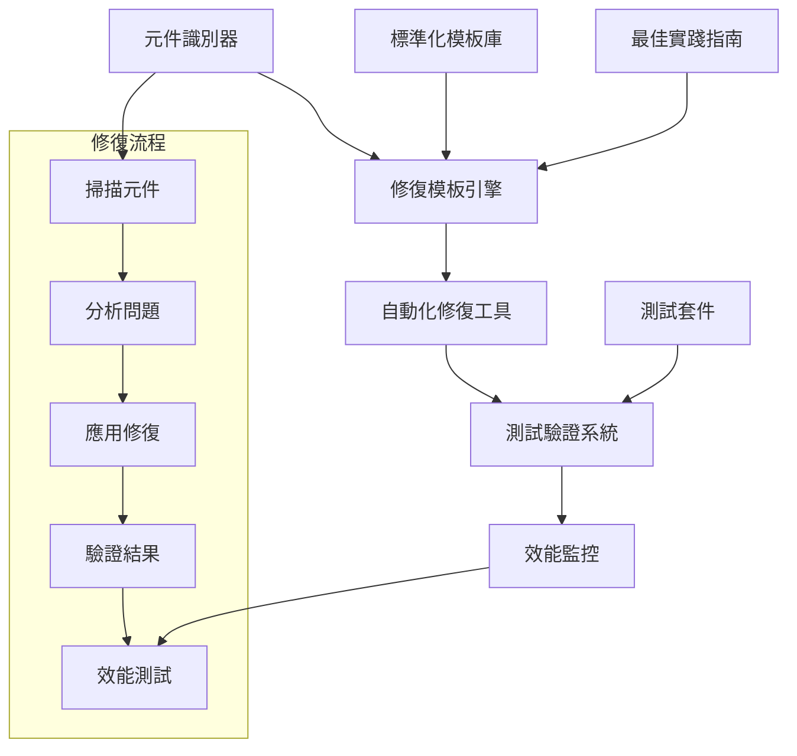

# Livewire 表單重置功能標準化設計文件

## 概述

本設計文件基於 ProfileForm 的成功修復經驗，提供一個系統性的解決方案來修復和標準化所有 Livewire 元件中的表單重置功能。設計重點在於解決 Livewire 3.0 中 DOM 更新機制在複雜表單中的失效問題。

## 架構設計

### 整體架構



### 核心元件架構

#### 1. 修復模板系統
```php
interface FormResetFixInterface
{
    public function identifyIssues(): array;
    public function applyStandardFix(): bool;
    public function validateFix(): bool;
    public function generateReport(): array;
}

abstract class BaseFormResetFix implements FormResetFixInterface
{
    protected string $componentPath;
    protected string $viewPath;
    protected array $issues = [];
    protected array $fixedItems = [];
    
    abstract protected function getWireModelPattern(): string;
    abstract protected function getResetMethodPattern(): string;
    abstract protected function applyWireModelFix(): bool;
    abstract protected function applyRefreshMechanism(): bool;
}
```

#### 2. 元件分類系統
```php
enum ComponentPriority: string
{
    case HIGH = 'high';
    case MEDIUM = 'medium';
    case LOW = 'low';
}

enum ComponentType: string
{
    case LIST_FILTER = 'list_filter';
    case FORM_MODAL = 'form_modal';
    case SETTINGS_FORM = 'settings_form';
    case MONITORING_CONTROL = 'monitoring_control';
}

class ComponentClassifier
{
    public function classifyComponent(string $path): ComponentType;
    public function determinePriority(ComponentType $type, array $usage): ComponentPriority;
    public function getFixStrategy(ComponentType $type): string;
}
```

## 詳細設計

### 1. 元件識別和分析系統

#### 元件掃描器
```php
class LivewireComponentScanner
{
    private array $scanPaths = [
        'app/Livewire/**/*.php',
        'resources/views/livewire/**/*.blade.php'
    ];
    
    public function scanForResetFunctions(): array
    {
        return [
            'resetFilters' => $this->findResetFilterMethods(),
            'resetForm' => $this->findResetFormMethods(),
            'clearFilters' => $this->findClearFilterMethods(),
        ];
    }
    
    public function scanForWireModelUsage(): array
    {
        return [
            'wire:model.lazy' => $this->findWireModelLazy(),
            'wire:model.live' => $this->findWireModelLive(),
            'wire:model.defer' => $this->findWireModelDefer(),
        ];
    }
    
    public function analyzeComplexity(string $componentPath): int
    {
        // 分析表單複雜度：欄位數量、巢狀結構、JavaScript 依賴等
    }
}
```

#### 問題識別器
```php
class IssueIdentifier
{
    public function identifyDOMSyncIssues(string $componentPath): array
    {
        return [
            'missing_wire_key' => $this->checkWireKeyUsage($componentPath),
            'incorrect_wire_model' => $this->checkWireModelType($componentPath),
            'missing_refresh_mechanism' => $this->checkRefreshMechanism($componentPath),
            'javascript_conflicts' => $this->checkJavaScriptConflicts($componentPath),
        ];
    }
    
    public function prioritizeIssues(array $issues): array
    {
        // 根據影響程度和修復難度排序
    }
}
```

### 2. 標準化修復模板

#### 核心修復模板
```php
class StandardFormResetFix extends BaseFormResetFix
{
    protected function applyWireModelFix(): bool
    {
        // 1. 將 wire:model.lazy 改為 wire:model.defer
        $this->replaceWireModelDirectives();
        
        // 2. 添加唯一的 wire:key 屬性
        $this->addWireKeyAttributes();
        
        return true;
    }
    
    protected function applyRefreshMechanism(): bool
    {
        // 1. 在 PHP 方法中添加 $this->dispatch('$refresh')
        $this->addDispatchRefresh();
        
        // 2. 添加自定義事件
        $this->addCustomEvent();
        
        // 3. 添加 JavaScript 監聽器
        $this->addJavaScriptListener();
        
        return true;
    }
    
    private function replaceWireModelDirectives(): void
    {
        $patterns = [
            '/wire:model\.lazy="([^"]+)"/' => 'wire:model.defer="$1"',
            '/wire:model\.live\.debounce\.\d+ms="([^"]+)"/' => 'wire:model.defer="$1"',
        ];
        
        foreach ($patterns as $pattern => $replacement) {
            $this->applyPatternReplacement($pattern, $replacement);
        }
    }
    
    private function addDispatchRefresh(): void
    {
        $refreshCode = '
        // 強制重新渲染元件以確保前端同步
        $this->dispatch(\'$refresh\');
        
        // 發送前端刷新事件
        $this->dispatch(\'{component-name}-reset\');';
        
        $this->insertAfterResetLogic($refreshCode);
    }
    
    private function addJavaScriptListener(): void
    {
        $jsCode = '
<script>
    document.addEventListener(\'livewire:init\', () => {
        Livewire.on(\'{component-name}-reset\', () => {
            console.log(\'🔄 收到 {component-name}-reset 事件，手動更新前端...\');
            
            setTimeout(() => {
                // 強制重新載入頁面以確保同步
                window.location.reload();
            }, 500);
        });
    });
</script>';
        
        $this->appendToViewFile($jsCode);
    }
}
```

#### 特定類型修復模板

##### 列表篩選器修復模板
```php
class ListFilterResetFix extends StandardFormResetFix
{
    protected function getSpecificFixes(): array
    {
        return [
            'search_field' => $this->fixSearchField(),
            'filter_selects' => $this->fixFilterSelects(),
            'pagination_reset' => $this->fixPaginationReset(),
        ];
    }
    
    private function fixSearchField(): void
    {
        // 特別處理搜尋欄位的即時搜尋功能
        $this->replacePattern(
            '/wire:model\.live\.debounce\.\d+ms="search"/',
            'wire:model.defer="search"'
        );
    }
    
    private function fixFilterSelects(): void
    {
        // 處理篩選下拉選單
        $this->replacePattern(
            '/wire:model\.live="(.*Filter)"/',
            'wire:model.defer="$1"'
        );
    }
}
```

##### 模態表單修復模板
```php
class ModalFormResetFix extends StandardFormResetFix
{
    protected function getSpecificFixes(): array
    {
        return [
            'modal_state_reset' => $this->fixModalStateReset(),
            'form_validation_reset' => $this->fixFormValidationReset(),
            'confirmation_fields' => $this->fixConfirmationFields(),
        ];
    }
    
    private function fixModalStateReset(): void
    {
        // 確保模態關閉時正確重置狀態
        $resetCode = '
        $this->showModal = false;
        $this->resetForm();
        
        // 強制重新渲染
        $this->dispatch(\'$refresh\');';
        
        $this->replaceInMethod('closeModal', $resetCode);
    }
}
```

### 3. 自動化修復工具

#### 修復執行器
```php
class FixExecutor
{
    private ComponentScanner $scanner;
    private IssueIdentifier $identifier;
    private array $fixTemplates;
    
    public function executeFullFix(): array
    {
        $results = [];
        
        // 1. 掃描所有元件
        $components = $this->scanner->scanAllComponents();
        
        // 2. 分析每個元件
        foreach ($components as $component) {
            $issues = $this->identifier->identifyDOMSyncIssues($component['path']);
            
            if (!empty($issues)) {
                $results[] = $this->fixComponent($component, $issues);
            }
        }
        
        return $results;
    }
    
    private function fixComponent(array $component, array $issues): array
    {
        $fixer = $this->getFixerForComponent($component);
        
        return [
            'component' => $component['name'],
            'issues_found' => count($issues),
            'fixes_applied' => $fixer->applyStandardFix(),
            'validation_result' => $fixer->validateFix(),
            'performance_impact' => $this->measurePerformanceImpact($component),
        ];
    }
}
```

#### 批次處理系統
```php
class BatchProcessor
{
    public function processByPriority(): void
    {
        $priorities = [
            ComponentPriority::HIGH,
            ComponentPriority::MEDIUM,
            ComponentPriority::LOW
        ];
        
        foreach ($priorities as $priority) {
            $this->processComponentsWithPriority($priority);
            $this->runValidationTests($priority);
            $this->generateProgressReport($priority);
        }
    }
    
    private function processComponentsWithPriority(ComponentPriority $priority): void
    {
        $components = $this->getComponentsByPriority($priority);
        
        foreach ($components as $component) {
            try {
                $this->processComponent($component);
                $this->logSuccess($component);
            } catch (Exception $e) {
                $this->logError($component, $e);
                $this->addToRetryQueue($component);
            }
        }
    }
}
```

### 4. 測試驗證系統

#### 自動化測試框架
```php
class FormResetTestSuite
{
    private PlaywrightTester $playwright;
    private MySQLTester $mysql;
    
    public function testComponentReset(string $componentName): TestResult
    {
        return new TestResult([
            'component' => $componentName,
            'frontend_test' => $this->testFrontendReset($componentName),
            'backend_test' => $this->testBackendReset($componentName),
            'integration_test' => $this->testFullIntegration($componentName),
            'performance_test' => $this->testPerformance($componentName),
        ]);
    }
    
    private function testFrontendReset(string $componentName): array
    {
        // 使用 Playwright 測試前端重置功能
        $this->playwright->navigate($this->getComponentUrl($componentName));
        
        // 填寫測試資料
        $this->fillTestData($componentName);
        
        // 執行重置
        $this->clickResetButton($componentName);
        
        // 驗證前端狀態
        return $this->validateFrontendState($componentName);
    }
    
    private function testBackendReset(string $componentName): array
    {
        // 使用 MySQL 驗證後端狀態
        $beforeState = $this->mysql->getComponentState($componentName);
        
        // 觸發重置
        $this->triggerReset($componentName);
        
        $afterState = $this->mysql->getComponentState($componentName);
        
        return $this->compareStates($beforeState, $afterState);
    }
}
```

#### 效能測試系統
```php
class PerformanceTestSuite
{
    public function measureResetPerformance(string $componentName): PerformanceMetrics
    {
        $metrics = new PerformanceMetrics();
        
        // 測量重置響應時間
        $startTime = microtime(true);
        $this->executeReset($componentName);
        $resetTime = microtime(true) - $startTime;
        
        // 測量頁面重新載入時間
        $startTime = microtime(true);
        $this->waitForPageReload();
        $reloadTime = microtime(true) - $startTime;
        
        // 測量記憶體使用
        $memoryUsage = $this->measureMemoryUsage($componentName);
        
        return $metrics->setData([
            'reset_time' => $resetTime,
            'reload_time' => $reloadTime,
            'memory_usage' => $memoryUsage,
            'total_time' => $resetTime + $reloadTime,
        ]);
    }
}
```

### 5. 監控和報告系統

#### 修復進度監控
```php
class ProgressMonitor
{
    public function generateProgressReport(): array
    {
        return [
            'total_components' => $this->getTotalComponentCount(),
            'components_fixed' => $this->getFixedComponentCount(),
            'components_tested' => $this->getTestedComponentCount(),
            'issues_resolved' => $this->getResolvedIssueCount(),
            'performance_improvements' => $this->getPerformanceImprovements(),
            'estimated_completion' => $this->estimateCompletion(),
        ];
    }
    
    public function generateDetailedReport(): string
    {
        $report = "# Livewire 表單重置修復報告\n\n";
        
        $report .= "## 修復統計\n";
        $report .= $this->generateStatistics();
        
        $report .= "\n## 元件修復詳情\n";
        $report .= $this->generateComponentDetails();
        
        $report .= "\n## 效能影響分析\n";
        $report .= $this->generatePerformanceAnalysis();
        
        $report .= "\n## 建議和後續步驟\n";
        $report .= $this->generateRecommendations();
        
        return $report;
    }
}
```

## 資料模型

### 元件資訊模型
```php
class ComponentInfo
{
    public string $name;
    public string $path;
    public string $viewPath;
    public ComponentType $type;
    public ComponentPriority $priority;
    public array $resetMethods;
    public array $wireModelUsage;
    public int $complexityScore;
    public array $dependencies;
}
```

### 修復結果模型
```php
class FixResult
{
    public string $componentName;
    public array $issuesFound;
    public array $fixesApplied;
    public bool $validationPassed;
    public PerformanceMetrics $performanceImpact;
    public array $testResults;
    public DateTime $fixedAt;
}
```

## 錯誤處理策略

### 修復失敗處理
```php
class FixErrorHandler
{
    public function handleFixFailure(string $component, Exception $error): void
    {
        // 1. 記錄詳細錯誤資訊
        $this->logError($component, $error);
        
        // 2. 回滾已應用的修改
        $this->rollbackChanges($component);
        
        // 3. 添加到重試佇列
        $this->addToRetryQueue($component, $error);
        
        // 4. 通知開發團隊
        $this->notifyDevelopers($component, $error);
    }
    
    public function handleValidationFailure(string $component, array $failures): void
    {
        // 處理驗證失敗的情況
        $this->analyzeValidationFailures($component, $failures);
        $this->suggestManualFixes($component, $failures);
    }
}
```

## 安全考量

### 程式碼修改安全
1. **備份機制**：修改前自動備份原始檔案
2. **版本控制**：所有修改都通過 Git 追蹤
3. **權限檢查**：確保只有授權的修復操作
4. **回滾機制**：提供快速回滾功能

### 測試環境隔離
1. **環境分離**：在測試環境中進行修復和驗證
2. **資料保護**：使用測試資料，避免影響生產資料
3. **權限限制**：限制修復工具的存取權限

## 效能優化策略

### 修復過程優化
1. **並行處理**：同時處理多個獨立元件
2. **增量修復**：優先處理高影響元件
3. **快取機制**：快取掃描和分析結果
4. **資源管理**：控制記憶體和 CPU 使用

### 運行時優化
1. **延遲載入**：避免不必要的頁面重新載入
2. **事件節流**：控制事件觸發頻率
3. **DOM 優化**：最小化 DOM 操作
4. **快取策略**：合理使用瀏覽器快取

這個設計提供了一個全面、系統化的解決方案來修復和標準化所有 Livewire 元件中的表單重置功能，確保一致性、可靠性和良好的使用者體驗。