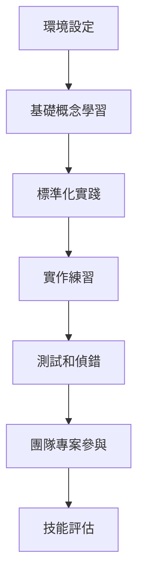

# Livewire 表單重置功能新人入職技術指導

## 🎯 入職指導概述

### 歡迎加入團隊！
歡迎加入我們的開發團隊！本指導文件將幫助您快速掌握 Livewire 表單重置功能的開發標準和最佳實踐，讓您能夠快速融入團隊並開始貢獻高品質的程式碼。

### 入職目標
- **第一週**: 熟悉開發環境和基礎概念
- **第二週**: 掌握標準化開發流程
- **第三週**: 獨立完成簡單功能開發
- **第四週**: 參與團隊專案並通過技能評估

### 學習路徑


## 📅 第一週：基礎準備

### Day 1: 環境設定和專案熟悉

#### 🔧 開發環境設定
**必要軟體安裝**:
```bash
# 1. 確認 Docker 和 Docker Compose 已安裝
docker --version
docker-compose --version

# 2. 克隆專案
git clone [專案倉庫URL]
cd [專案目錄]

# 3. 啟動開發環境
docker-compose up -d

# 4. 安裝依賴
docker-compose exec app composer install
docker-compose exec app npm install

# 5. 設定環境變數
cp .env.example .env
# 編輯 .env 檔案設定資料庫連線

# 6. 執行資料庫遷移和種子
docker-compose exec app php artisan migrate --seed

# 7. 驗證安裝
docker-compose exec app php artisan test
```

**IDE 設定**:
- 安裝 VS Code 或 PhpStorm
- 安裝必要的外掛程式
- 設定程式碼格式化規則
- 配置偵錯環境

#### 📚 專案結構熟悉
**重要目錄說明**:
```
project/
├── app/Livewire/           # Livewire 元件
├── resources/views/livewire/ # Livewire 視圖
├── tests/Unit/Livewire/    # 單元測試
├── tests/Browser/          # 瀏覽器測試
├── docs/                   # 專案文檔
├── scripts/                # 自動化腳本
└── .kiro/specs/           # 專案規格文檔
```

**核心檔案**:
- `docs/livewire-form-reset-best-practices.md` - 最佳實踐指南
- `docs/livewire-form-reset-troubleshooting-guide.md` - 故障排除指南
- `docs/livewire-component-templates.md` - 元件模板

#### ✅ Day 1 檢查清單
- [ ] 開發環境成功啟動
- [ ] 能夠存取本地應用程式 (http://localhost)
- [ ] 測試套件執行成功
- [ ] IDE 設定完成
- [ ] 閱讀專案 README

### Day 2: Livewire 基礎概念

#### 📖 必讀文檔
1. **Livewire 官方文檔** (2 小時)
   - [Livewire 3.0 介紹](https://laravel-livewire.com/docs/3.x/quickstart)
   - [元件基礎](https://laravel-livewire.com/docs/3.x/components)
   - [資料綁定](https://laravel-livewire.com/docs/3.x/properties)

2. **專案最佳實踐指南** (1 小時)
   - 閱讀 `docs/livewire-form-reset-best-practices.md`
   - 理解標準化修復流程
   - 學習 DOM 結構規範

#### 🎯 學習重點
**核心概念**:
```php
// Livewire 元件基本結構
<?php

namespace App\Livewire\Admin;

use Livewire\Component;

class ExampleComponent extends Component
{
    // 公開屬性 - 會自動同步到前端
    public $name = '';
    public $email = '';
    
    // 計算屬性 - 動態計算值
    public function getFullNameProperty()
    {
        return $this->name . ' (' . $this->email . ')';
    }
    
    // 動作方法 - 處理使用者互動
    public function save()
    {
        $this->validate([
            'name' => 'required',
            'email' => 'required|email',
        ]);
        
        // 儲存邏輯
    }
    
    // 渲染方法 - 回傳視圖
    public function render()
    {
        return view('livewire.admin.example-component');
    }
}
```

**資料綁定類型**:
```blade
<!-- wire:model.defer - 延遲同步（推薦用於表單） -->
<input type="text" wire:model.defer="name">

<!-- wire:model.lazy - 失去焦點時同步 -->
<input type="text" wire:model.lazy="search">

<!-- wire:model.live - 即時同步 -->
<input type="text" wire:model.live="filter">
```

#### 🛠️ 實作練習
**練習 1**: 建立第一個 Livewire 元件
```bash
# 建立元件
docker-compose exec app php artisan make:livewire HelloWorld

# 檔案位置：
# app/Livewire/HelloWorld.php
# resources/views/livewire/hello-world.blade.php
```

**練習目標**:
- 建立簡單的問候表單
- 實作姓名輸入和顯示
- 添加簡單的驗證

#### ✅ Day 2 檢查清單
- [ ] 完成 Livewire 官方文檔閱讀
- [ ] 理解資料綁定機制
- [ ] 完成 HelloWorld 元件練習
- [ ] 能夠解釋 Livewire 的基本工作原理

### Day 3: 表單重置問題理解

#### 🔍 問題分析學習
**常見問題類型**:

1. **DOM 同步失效**
```php
// ❌ 問題範例
public function resetForm()
{
    $this->name = '';
    $this->email = '';
    // 問題：前端不會更新
}

// ✅ 正確做法
public function resetForm()
{
    $this->reset(['name', 'email']);
    $this->dispatch('$refresh'); // 強制刷新
}
```

2. **缺少 wire:key**
```blade
<!-- ❌ 問題範例 -->
@foreach($items as $item)
    <div>{{ $item->name }}</div>
@endforeach

<!-- ✅ 正確做法 -->
@foreach($items as $item)
    <div wire:key="item-{{ $item->id }}">{{ $item->name }}</div>
@endforeach
```

3. **事件處理衝突**
```javascript
// ❌ 問題範例
$('#reset-btn').click(function() {
    // 直接操作 DOM，與 Livewire 衝突
    $('input').val('');
});

// ✅ 正確做法
document.addEventListener('livewire:init', () => {
    Livewire.on('form-reset', () => {
        // 使用 Livewire 事件系統
        console.log('表單已重置');
    });
});
```

#### 📋 案例研究
**案例 1**: UserList 元件篩選重置問題
- **問題描述**: 點擊重置按鈕後，搜尋欄位沒有清空
- **根本原因**: 使用 `wire:model.lazy` 且缺少刷新機制
- **解決方案**: 改用 `wire:model.defer` 並添加 `$this->dispatch('$refresh')`

**案例 2**: Modal 表單重置問題
- **問題描述**: 關閉模態對話框後，下次開啟時仍顯示舊資料
- **根本原因**: 模態關閉時沒有重置表單狀態
- **解決方案**: 在關閉方法中添加完整的重置邏輯

#### ✅ Day 3 檢查清單
- [ ] 理解四種主要問題類型
- [ ] 能夠識別問題程式碼
- [ ] 完成案例研究分析
- [ ] 掌握基本的解決思路

### Day 4: 標準化解決方案

#### 🎯 標準修復流程
**完整的重置方法模板**:
```php
public function resetForm()
{
    // 1. 重置資料屬性
    $this->reset([
        'name',
        'email',
        'selectedRoles',
        // 列出所有需要重置的屬性
    ]);
    
    // 2. 清除驗證錯誤
    $this->resetValidation();
    
    // 3. 重置狀態屬性
    $this->showModal = false;
    $this->editingUser = null;
    
    // 4. 強制重新渲染（關鍵步驟）
    $this->dispatch('$refresh');
    
    // 5. 發送自定義事件
    $this->dispatch('user-form-reset');
    
    // 6. 記錄操作（可選）
    logger('User form reset by: ' . auth()->id());
}
```

**DOM 結構標準**:
```blade
<form wire:submit.prevent="submitForm" wire:key="user-form">
    <div class="space-y-6" wire:key="form-container">
        <!-- 基本資訊區塊 -->
        <div class="bg-white rounded-lg p-6" wire:key="basic-info-section">
            <h3 wire:key="basic-info-title">基本資訊</h3>
            
            <div class="grid grid-cols-2 gap-4" wire:key="basic-fields-grid">
                <div wire:key="name-field-wrapper">
                    <label wire:key="name-label">姓名</label>
                    <input type="text" 
                           wire:model.defer="name" 
                           wire:key="name-input"
                           class="form-input">
                </div>
                
                <div wire:key="email-field-wrapper">
                    <label wire:key="email-label">電子郵件</label>
                    <input type="email" 
                           wire:model.defer="email" 
                           wire:key="email-input"
                           class="form-input">
                </div>
            </div>
        </div>
    </div>
    
    <!-- 操作按鈕 -->
    <div class="flex justify-end space-x-3 mt-6" wire:key="form-actions">
        <button type="button" 
                wire:click="resetForm" 
                wire:key="reset-button"
                class="btn-secondary">
            重置
        </button>
        <button type="submit" 
                wire:key="submit-button"
                class="btn-primary">
            儲存
        </button>
    </div>
</form>
```

**JavaScript 事件處理**:
```blade
<script>
document.addEventListener('livewire:init', () => {
    Livewire.on('user-form-reset', () => {
        console.log('🔄 使用者表單已重置');
        
        // 可選：顯示成功訊息
        showNotification('表單已重置', 'success');
        
        // 可選：執行額外的前端清理
        clearCustomValidation();
    });
});

function showNotification(message, type) {
    // 實作通知顯示邏輯
    console.log(`${type.toUpperCase()}: ${message}`);
}

function clearCustomValidation() {
    // 清除自定義驗證樣式
    document.querySelectorAll('.error-highlight').forEach(el => {
        el.classList.remove('error-highlight');
    });
}
</script>
```

#### 🛠️ 實作練習
**練習 2**: 修復問題元件
```php
// 給定一個有問題的元件，請修復它
class BrokenUserForm extends Component
{
    public $username = '';
    public $email = '';
    public $showForm = false;
    
    public function resetForm()
    {
        $this->username = '';
        $this->email = '';
        // TODO: 修復這個方法
    }
    
    public function render()
    {
        return view('livewire.broken-user-form');
    }
}
```

#### ✅ Day 4 檢查清單
- [ ] 掌握標準修復流程
- [ ] 理解 DOM 結構規範
- [ ] 完成修復練習
- [ ] 能夠應用標準模板

### Day 5: 測試和驗證

#### 🧪 測試方法學習
**單元測試範例**:
```php
<?php

namespace Tests\Unit\Livewire;

use Tests\TestCase;
use App\Livewire\Admin\UserForm;
use Livewire\Livewire;

class UserFormTest extends TestCase
{
    /** @test */
    public function it_can_reset_form_properly()
    {
        Livewire::test(UserForm::class)
            ->set('username', 'testuser')
            ->set('email', 'test@example.com')
            ->call('resetForm')
            ->assertSet('username', '')
            ->assertSet('email', '')
            ->assertSet('showForm', false)
            ->assertHasNoErrors();
    }
    
    /** @test */
    public function it_dispatches_events_on_reset()
    {
        Livewire::test(UserForm::class)
            ->call('resetForm')
            ->assertDispatched('$refresh')
            ->assertDispatched('user-form-reset');
    }
    
    /** @test */
    public function it_clears_validation_errors_on_reset()
    {
        Livewire::test(UserForm::class)
            ->set('email', 'invalid-email')
            ->call('save') // 觸發驗證錯誤
            ->assertHasErrors('email')
            ->call('resetForm')
            ->assertHasNoErrors();
    }
}
```

**瀏覽器測試範例**:
```php
<?php

namespace Tests\Browser;

use Tests\DuskTestCase;
use Laravel\Dusk\Browser;

class UserFormBrowserTest extends DuskTestCase
{
    /** @test */
    public function user_can_reset_form_successfully()
    {
        $this->browse(function (Browser $browser) {
            $browser->visit('/admin/users/create')
                ->type('input[wire\\:model\\.defer="username"]', 'testuser')
                ->type('input[wire\\:model\\.defer="email"]', 'test@example.com')
                ->click('@reset-button')
                ->waitFor('.notification')
                ->assertValue('input[wire\\:model\\.defer="username"]', '')
                ->assertValue('input[wire\\:model\\.defer="email"]', '');
        });
    }
}
```

#### 🔍 偵錯工具使用
**瀏覽器偵錯**:
```javascript
// 在瀏覽器 Console 中使用
// 檢查所有 Livewire 元件
Livewire.all();

// 檢查特定元件
Livewire.find('component-id');

// 檢查元件資料
Livewire.find('component-id').data;

// 手動觸發方法
Livewire.find('component-id').call('resetForm');
```

**PHP 偵錯**:
```php
// 在 Livewire 元件中添加偵錯資訊
public function resetForm()
{
    logger('Reset form called', [
        'user_id' => auth()->id(),
        'component' => static::class,
        'data_before' => $this->all()
    ]);
    
    $this->reset(['username', 'email']);
    $this->resetValidation();
    $this->dispatch('$refresh');
    
    logger('Reset form completed');
}
```

#### 🛠️ 實作練習
**練習 3**: 撰寫測試
為您在 Day 4 修復的元件撰寫完整的測試套件，包括：
- 基本功能測試
- 重置功能測試
- 事件觸發測試
- 驗證清除測試

#### ✅ Day 5 檢查清單
- [ ] 理解測試的重要性
- [ ] 能夠撰寫基本的單元測試
- [ ] 掌握偵錯工具的使用
- [ ] 完成測試撰寫練習

## 📅 第二週：深入實踐

### Day 6-7: 複雜場景處理

#### 🎯 學習目標
- 處理巢狀表單重置
- 處理檔案上傳表單重置
- 處理動態欄位表單重置
- 處理多步驟表單重置

#### 📚 進階案例學習
**案例 1**: 巢狀表單重置
```php
class NestedForm extends Component
{
    public $user = [
        'name' => '',
        'email' => '',
        'profile' => [
            'bio' => '',
            'avatar' => null,
        ],
        'settings' => [
            'notifications' => true,
            'theme' => 'light',
        ]
    ];
    
    public function resetForm()
    {
        $this->reset(['user']);
        
        // 重新初始化巢狀結構
        $this->user = [
            'name' => '',
            'email' => '',
            'profile' => [
                'bio' => '',
                'avatar' => null,
            ],
            'settings' => [
                'notifications' => true,
                'theme' => 'light',
            ]
        ];
        
        $this->resetValidation();
        $this->dispatch('$refresh');
        $this->dispatch('nested-form-reset');
    }
}
```

**案例 2**: 檔案上傳表單重置
```php
use Livewire\WithFileUploads;

class FileUploadForm extends Component
{
    use WithFileUploads;
    
    public $name = '';
    public $avatar;
    public $documents = [];
    
    public function resetForm()
    {
        $this->reset(['name', 'avatar', 'documents']);
        $this->resetValidation();
        
        // 清理暫存檔案
        $this->cleanupTemporaryFiles();
        
        $this->dispatch('$refresh');
        $this->dispatch('file-form-reset');
    }
    
    private function cleanupTemporaryFiles()
    {
        // 清理 Livewire 暫存檔案
        // 這通常由 Livewire 自動處理，但可以手動清理
    }
}
```

#### 🛠️ 實作練習
**練習 4**: 建立複雜表單
建立一個包含以下功能的使用者註冊表單：
- 基本資訊（姓名、電子郵件）
- 個人檔案（頭像上傳、自我介紹）
- 偏好設定（通知設定、主題選擇）
- 多步驟流程（3 個步驟）

### Day 8-9: 效能優化

#### 🚀 效能優化技巧
**避免不必要的重新渲染**:
```php
class OptimizedForm extends Component
{
    public $formData = [];
    public $uiState = [
        'showAdvanced' => false,
        'currentStep' => 1,
    ];
    
    public function resetForm()
    {
        // 只重置表單資料，保留 UI 狀態
        $this->reset(['formData']);
        $this->resetValidation();
        
        // 有條件的刷新
        if ($this->shouldForceRefresh()) {
            $this->dispatch('$refresh');
        }
        
        $this->dispatch('form-reset');
    }
    
    private function shouldForceRefresh()
    {
        // 根據條件決定是否需要強制刷新
        return !empty($this->formData) || $this->hasValidationErrors();
    }
}
```

**批次操作優化**:
```php
public function resetMultipleForms()
{
    // 批次重置多個表單區塊
    $this->reset([
        'userForm',
        'profileForm',
        'settingsForm'
    ]);
    
    $this->resetValidation();
    
    // 只觸發一次刷新
    $this->dispatch('$refresh');
    $this->dispatch('multiple-forms-reset');
}
```

#### 📊 效能監控
```php
public function resetForm()
{
    $startTime = microtime(true);
    
    $this->reset(['formData']);
    $this->resetValidation();
    $this->dispatch('$refresh');
    
    $executionTime = microtime(true) - $startTime;
    
    // 記錄效能資訊
    if ($executionTime > 0.1) { // 超過 100ms
        logger('Slow form reset detected', [
            'component' => static::class,
            'execution_time' => $executionTime,
            'memory_usage' => memory_get_usage(true)
        ]);
    }
}
```

### Day 10: 自動化工具使用

#### 🛠️ 程式碼生成工具
```bash
# 使用專案提供的生成工具
./scripts/generate-livewire-component.sh UserProfile

# 使用品質檢查工具
php scripts/check-livewire-standards.php app/Livewire/Admin/UserProfile.php

# 執行自動化測試生成
php scripts/generate-livewire-tests.php UserProfile
```

#### 🔍 自動化檢查
```bash
# 執行程式碼品質檢查
./vendor/bin/phpcs --standard=.phpcs.xml app/Livewire/

# 執行靜態分析
./vendor/bin/phpstan analyse app/Livewire/

# 執行 Livewire 特定檢查
php scripts/livewire-standards-check.php
```

## 📅 第三週：團隊專案參與

### Day 11-15: 真實專案實作

#### 🎯 專案任務
您將被分配到一個真實的專案任務，可能包括：
- 修復現有元件的表單重置問題
- 開發新的 Livewire 元件
- 撰寫或改進測試
- 更新技術文檔

#### 👥 團隊協作
**每日站會參與**:
- 報告昨日完成的工作
- 說明今日計畫
- 提出遇到的問題或需要的協助

**程式碼審查參與**:
- 提交 Pull Request
- 參與程式碼審查討論
- 學習從審查回饋中改進

**技術討論參與**:
- 參加技術討論會議
- 分享學習心得
- 提出改進建議

#### 📝 工作記錄
**每日工作日誌**:
```markdown
# 工作日誌 - Day 11

## 完成的工作
- 修復 UserList 元件的篩選重置問題
- 為 UserForm 元件添加測試
- 更新相關文檔

## 遇到的問題
- 複雜的巢狀表單重置邏輯
- 測試中的非同步處理

## 解決方案
- 參考標準模板重構重置邏輯
- 使用 waitFor 處理非同步測試

## 明日計畫
- 完成 UserForm 元件的瀏覽器測試
- 開始 ProfileForm 元件的開發

## 學習心得
- 深入理解了 wire:key 的重要性
- 學會了使用偵錯工具診斷問題
```

## 📅 第四週：技能評估和認證

### Day 16-18: 綜合專案

#### 🎯 專案要求
**專案描述**: 建立一個完整的任務管理系統
**功能需求**:
- 任務列表顯示和篩選
- 任務建立和編輯表單
- 任務狀態管理
- 搜尋和排序功能

**技術要求**:
- 使用 Livewire 3.0
- 遵循專案標準化規範
- 實作完整的表單重置功能
- 包含完整的測試覆蓋
- 撰寫清晰的文檔

#### 📋 評估標準
```yaml
功能完整性 (30%):
  - 所有功能正常運作
  - 表單重置功能完善
  - 使用者體驗良好
  - 錯誤處理適當

程式碼品質 (30%):
  - 遵循專案規範
  - 程式碼結構清晰
  - 適當的註解說明
  - 無明顯的程式碼異味

測試覆蓋 (25%):
  - 單元測試覆蓋率 > 90%
  - 瀏覽器測試完整
  - 邊界條件測試
  - 效能測試包含

文檔品質 (15%):
  - API 文檔完整
  - 使用說明清楚
  - 安裝和設定指南
  - 故障排除說明
```

### Day 19-20: 技能評估

#### 📝 理論測試 (1 小時)
**測試內容**:
- Livewire 3.0 基礎概念 (25%)
- 表單重置最佳實踐 (35%)
- 測試和偵錯方法 (25%)
- 效能優化技巧 (15%)

**範例題目**:
```
1. 在 Livewire 表單重置方法中，以下哪些步驟是必須的？
   A. $this->reset()
   B. $this->resetValidation()
   C. $this->dispatch('$refresh')
   D. 以上皆是

2. 請解釋 wire:model.defer 和 wire:model.lazy 的差異，並說明在什麼情況下應該使用哪一個。

3. 以下程式碼有什麼問題？請提供修正建議。
   [程式碼範例]
```

#### 💻 實作評估 (2 小時)
**評估任務**:
1. **問題診斷** (30 分鐘)
   - 給定一個有問題的 Livewire 元件
   - 識別問題並提供解決方案

2. **功能實作** (60 分鐘)
   - 根據需求實作一個新的 Livewire 元件
   - 包含完整的表單重置功能

3. **測試撰寫** (30 分鐘)
   - 為實作的元件撰寫測試
   - 包含單元測試和基本的瀏覽器測試

#### 🗣️ 技術面談 (30 分鐘)
**面談內容**:
- 專案經驗分享
- 技術問題討論
- 學習心得總結
- 未來發展規劃

## 🎓 認證和後續發展

### 認證等級

#### 🥉 初級認證
**要求**:
- 理論測試 ≥ 80%
- 實作評估 ≥ 75%
- 專案完成度 ≥ 80%

**能力標準**:
- 能夠使用標準模板開發 Livewire 元件
- 理解表單重置的基本原理
- 能夠撰寫基本的測試

#### 🥈 中級認證
**要求**:
- 理論測試 ≥ 85%
- 實作評估 ≥ 85%
- 專案完成度 ≥ 90%
- 程式碼品質優秀

**能力標準**:
- 能夠處理複雜的表單重置場景
- 具備效能優化意識
- 能夠指導初級開發者

#### 🥇 高級認證
**要求**:
- 理論測試 ≥ 90%
- 實作評估 ≥ 90%
- 專案完成度 ≥ 95%
- 有創新或改進貢獻

**能力標準**:
- 深度理解 Livewire 內部機制
- 能夠開發自動化工具
- 具備培訓和指導能力

### 持續學習路徑

#### 📈 技能提升
- **進階 Livewire 技巧**: 學習更高級的 Livewire 功能
- **效能優化專精**: 深入學習效能優化技巧
- **工具開發**: 開發自動化工具和輔助程式
- **架構設計**: 學習大型應用的架構設計

#### 🎯 職涯發展
- **技術專家**: 成為 Livewire 技術專家
- **團隊領導**: 領導技術團隊
- **培訓講師**: 培訓新進開發者
- **開源貢獻**: 為開源專案做貢獻

## 📞 支援和資源

### 🆘 獲得協助
- **導師制度**: 每位新人都有指定的技術導師
- **即時聊天**: Slack #livewire-help 頻道
- **辦公時間**: 每週二、四下午 2-4 點技術諮詢時間
- **文檔資源**: 完整的內部技術文檔庫

### 📚 學習資源
- **內部文檔**: 專案技術文檔和最佳實踐指南
- **影片教學**: 內部錄製的技術教學影片
- **程式碼範例**: GitHub 上的範例程式碼庫
- **外部資源**: 精選的外部學習資源清單

### 🤝 社群參與
- **內部論壇**: 技術討論和問題解答
- **技術分享會**: 每月的技術分享活動
- **讀書會**: 技術書籍讀書會
- **外部會議**: 參加 Laravel/Livewire 相關會議

---

## 🎉 歡迎加入我們的團隊！

恭喜您完成了入職指導的學習！我們相信通過系統性的學習和實踐，您已經具備了在我們團隊中成功工作的技能。

記住，學習是一個持續的過程。技術在不斷發展，我們的標準和最佳實踐也會持續改進。保持學習的熱忱，積極參與團隊活動，不斷提升自己的技能水平。

如果您有任何問題或建議，請隨時與我們聯繫。我們期待看到您在團隊中的出色表現！

**祝您在新的職涯旅程中一切順利！** 🚀